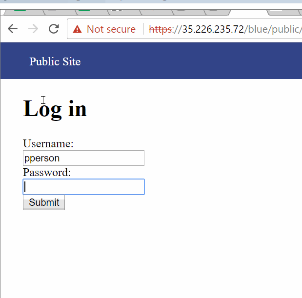

# Project 8 - Pentesting Live Targets

Time spent: **X** hours spent in total

> Objective: Identify vulnerabilities in three different versions of the Globitek website: blue, green, and red.

The six possible exploits are:
* Username Enumeration
* Insecure Direct Object Reference (IDOR)
* SQL Injection (SQLi)
* Cross-Site Scripting (XSS)
* Cross-Site Request Forgery (CSRF)
* Session Hijacking/Fixation

Each version of the site has been given two of the six vulnerabilities. (In other words, all six of the exploits should be assignable to one of the sites.)

## Blue

Vulnerability #1: SQL Injection -
  It is clear that the blue site is not sanitizing its input. When looking at the salespeople you can change the salesperson's id to an SQL injection, such as ' OR SLEEP(10)=0--'. By doing this you can observe that the blue site is not sanitizing for SQL injections because this SQL injection forces the query to stall for 10 seconds. This is observable when the site takes an extra 10 seconds to load, which the red and green sites are not doing.

Video walkthrough -

Vulnerability #2: Session ID Hacking - 
  By using a session ID tool to change the session ID of the site when you are not logged in to the session ID of the site when you are logged in, you can essentially go from being logged out to being logged in without every entering a username and password. I logged in on chrome and then using the session ID tool provided by codepath changed the session ID of the site when I was logged out on internet explorer to the same ID as the logged in chrome page. Then after refreshing I was able to access all of the restricted information.
  
Video walkthrough - 

## Green

Vulnerability #1: Username Enumeration -
  The vulnerability that is evident here is gaining insight into users information from a false login attempt. The green site provides this information to an attacker. If you enter a username that does not have a valid account the error message is "Log in was unsuccessful" in plain print, however, if you enter a username that does exist within the system but just with an incorrect password the error message is bolded, informing the attacker that they have entered a valid username.
  
Video walkthrough - 
 

Vulnerability #2: XSS attack - 
  An attacker can insert malicious code into the feedback form from the public site and then when the admin goes to view that feedback an "attack" message occurs. Code such as  is sufficient to carry out this attack
  
Video walkthrough - 

## Red

Vulnerability #1: Insecure Direct Object Reference - 
  By changing the id number of the salespeople you can access salespersons who have not yet begun to work or who have been fired. For example, changing the ID number to 10 or 11 reveals two salespeople who are not seen on the public site and even provides the reason that one of them was fired for "FIRED FOR STEALING". The blue and green sites avoid this by sending you back to the salespersons general page when you enter a salesperson ID number that is not currently working for the company.
  
Video walkthrough - 

Vulnerability #2: CSRF Attack - 
  By inserting an html form into the feedback response form, you can trick the admin into opening that form and allowing it to make changes to the site. For this attack I created an html file that changes "Irene Boling" to "Ireeeeeene BOWLING". I submited the path to this form in a feedback form and when someone logged in as admin accessed this html file, it was able to make changes to that salesperson's information. 
  
Video walkthrough - 

## Notes

After last weeks lab, I found these challenges to be much more straight forward
